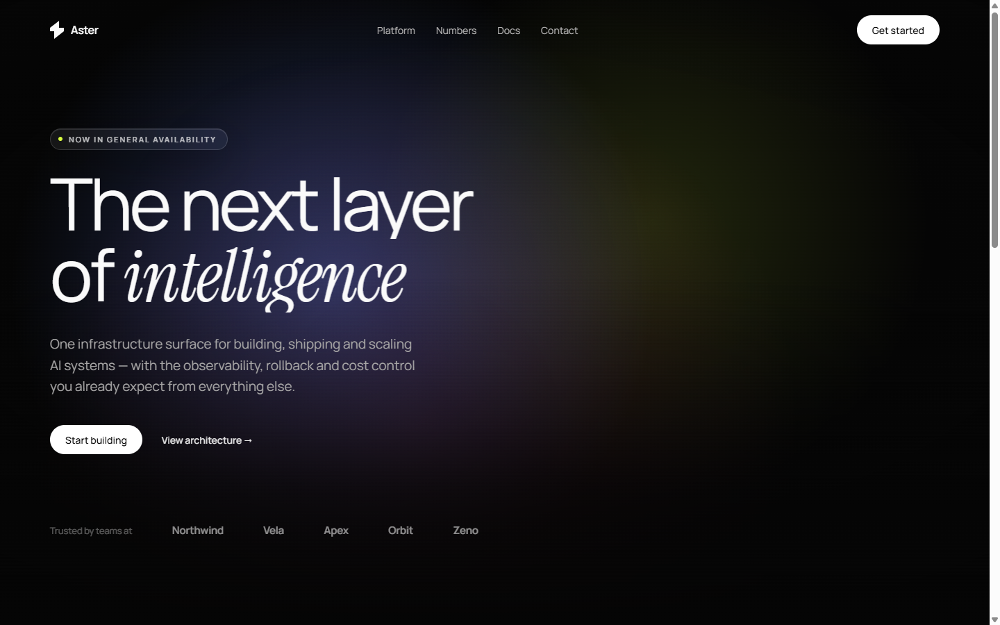

<div align="center">

# Premium Web Motion

**A Claude Code skill for building award-tier animated websites — and for writing the measured
spec-prompts that make other AI builders produce them.**

[](https://code.claude.com)
[](LICENSE)

</div>



---

## Install

```
/plugin marketplace add YOUR_GITHUB_USER/premium-web-motion-skill
/plugin install premium-web-motion-skill@premium-web-motion-skill
```

Then start a new session. If the install summary says `Run /reload-plugins to activate.`, run that.

<details>
<summary>Manual install (no marketplace)</summary>

```bash
git clone https://github.com/YOUR_GITHUB_USER/premium-web-motion-skill
cp -r premium-web-motion-skill/plugins/premium-web-motion-skill/skills/premium-web-motion-skill \
      ~/.claude/skills/
```
</details>

## Use it

```
/premium-web-motion-skill
```

Or just describe the work — the skill triggers on its own:

> *"build me a cinematic hero with a video background"*
> *"add scroll reveals to this landing page"*
> *"write a prompt for v0 that builds a premium SaaS hero"*
> *"make this section feel more expensive"*

**If you paste a spec, it builds that spec — verbatim.** The skill's own tokens, palette and
cascade are fallbacks for when you gave it nothing but a sentence. A supplied prompt's colours,
fonts, durations and easings are reproduced exactly, never normalised toward a house style.

It runs in one of three modes:

- **Build it** — you want the page, section, or component. It reads the tokens plus the one or
  two recipe files it needs and writes the code.
- **Spec it** — you want a *prompt* for v0 / Lovable / Bolt / Figma Make. It follows a
  14-section blueprint that pins down every number.
- **Match a reference** — you point at a site or video and say "like this". It decomposes in a
  fixed order (stage → composition → type → palette → motion inventory → timing → responsive →
  constraints), then builds or specs.

---

## What's inside

**108 distinct motion mechanisms**, distilled from a corpus of production motion specs and
organised into ten families. Not a list of CSS snippets — a system with tokens, budgets and
failure modes.

| Reference | Covers |
|---|---|
| `design-directions.md` | **Ten distinct visual directions** with palettes, type pairings, layouts and motion signatures — plus the sector table and the rules that stop every build looking the same |
| `project-structure.md` | The React / Tailwind / Framer Motion / TypeScript tree, file-size ceilings, where tokens, variants, hooks and content live |
| `pattern-catalog.md` | All 108 mechanisms in 10 families, each pointing at its source case |
| `prompt-blueprint.md` | The 14-section spec-prompt template + language rules |
| `example-prompts.md` | 4 complete copy-ready prompts at 4 scales |
| `motion-tokens.md` | Easing / duration / stagger / distance, with frequency data |
| `entrance-choreography.md` | Cascades: CSS, WAAPI, Framer · pre-paint guard · clip-path wipes · splash gates |
| `scroll-systems.md` | Reveals · lerp smoothing · parallax · sticky cinema rig · phase math |
| `video-techniques.md` | 8 video mechanisms: fade-loop, boomerang canvas, crossfade, scroll/mouse scrub, sync, masking |
| `text-effects.md` | Line clip reveal · word stagger · per-char scroll scrub · scramble · marquee · counters |
| `hover-and-cursor.md` | Microstates · magnetic · cursor spotlight mask · 3D tilt · group hover |
| `ambient-and-surfaces.md` | Liquid glass + the mask-composite gradient border · gradient blobs · grain · progressive blur · sheen |
| `responsive-and-a11y.md` | Height-locked `--u` units · drawers · reduced motion · performance |
| `component-index.md` | 144 reference cases tagged by technique, with reverse lookup |

<details>
<summary>Optional: a local source-case library</summary>

If you have your own corpus of reference specs, drop them in
`references/source-cases/` as `<id>.md` and run `node tools/build_source_index.mjs`. The skill
detects the directory, opens the index, and reads one matching case per section before building —
a different case for the hero, the features grid, the pricing block and the footer, so a page is
composed rather than stamped.

The directory is gitignored and ships with nothing in it. Without it the skill works exactly as
documented above and never mentions its absence.
</details>

Plus drop-in code that works with or without Claude:

```html
<head>
  <script>
    // BEFORE the stylesheet — arms the entrance so the finished page never flashes.
    // With JS off, nothing is armed and the complete page renders statically.
    if (!matchMedia('(prefers-reduced-motion: reduce)').matches
        && typeof Element.prototype.animate === 'function') {
      document.documentElement.classList.add('entrance-pending');
      window.__entranceFallback = setTimeout(function () {
        document.documentElement.classList.remove('entrance-pending');
      }, 3500);
    }
  </script>
  <link rel="stylesheet" href="motion.css">
</head>
<body>
  <h1><span class="m-line-mask"><span data-anim="line" style="--d:300ms">Headline</span></span></h1>
  <p data-anim="rise" style="--d:740ms;--rise:10px">Subcopy.</p>
  <div data-reveal style="--d:120ms">Reveals on scroll, once.</div>
  <span data-count="1284" data-suffix="+" class="m-nums">0</span>
  <script src="motion.js"></script>   <!-- self-initialises, zero dependencies -->
</body>
```

`Motion` also exposes each piece: `reveal`, `parallax`, `pointer`, `magnetic`, `tilt`, `counter`,
`scramble`, `videoLoop`, `videoScrub`, `marquee`, `drawer`, `subscribe`, and
`utils.{clamp,lerp,smoothstep,segmentInOut}`.

See it dressed:

```bash
cd plugins/premium-web-motion-skill/skills/premium-web-motion-skill/assets && npx serve .
```

---

## A few things the research showed

| Finding | Evidence |
|---|---|
| Two easing curves carry the whole category | `cubic-bezier(0.16,1,0.3,1)` ×41, `cubic-bezier(0.22,1,0.36,1)` ×30 |
| 800ms is the entrance median | 300 / 500 / 400 / 800ms are the four most frequent durations |
| `linear` is for loops and nothing else | 233 occurrences, essentially all marquees and drifts |
| Bounce easing is nearly absent | 2 back-out curves in 144 references |
| Video plates and glass are the visual signature | 82 of 144 each |
| Reduced motion is specified, not assumed | 21 references branch on it explicitly |
| **Zero motion is a valid answer** | 5 references forbid animation outright as a hard constraint |
| **The category is mostly light, not dark** | 92 of 144 specs are light-dominant, only 24 dark |
| It is also mostly React | 123 React · 116 Tailwind · 86 TypeScript · 41 Framer Motion · 6 single-file HTML |

### The trap that catches everyone

An entrance animation with `animation-fill-mode: forwards` or `both` leaves a `transform` on the
element permanently. That creates a containing block, which **silently disables `backdrop-filter`
on every descendant** — your liquid glass renders opaque and nothing in DevTools tells you why.

Use `backwards` on any entrance whose subtree contains glass.

### House style: no emoji, ever

The skill enforces a hard content rule alongside the motion rules — no emoji or pictographs in
markup, copy, `alt` text, `<title>`, comments or commit messages; icons are inline SVG at
`stroke-width: 1.5` in `currentColor`, never a rocket or sparkle standing in for artwork; no
decorative ASCII ornament; no exclamation marks or hype vocabulary in UI copy. Proper typography
(em dash, curly quotes, `×`, `≤`, `·`) is required, not banned. Spec-prompts carry the same rule
into their `DO NOT` section so downstream builders inherit it. Only an explicit user request for
emoji overrides this.

---

## Repo layout

```
.claude-plugin/marketplace.json          marketplace catalog
plugins/premium-web-motion-skill/
  .claude-plugin/plugin.json             plugin manifest
  skills/premium-web-motion-skill/
    SKILL.md                             router, method, tokens, non-negotiables
    references/                          12 reference files
    assets/motion.css                    tokens, keyframes, utilities, surfaces
    assets/motion.js                     zero-dependency runtime
    assets/demo.html                     a finished page built on both
tools/                                   corpus extraction + analysis scripts
```

## Contributing

Issues and PRs welcome — particularly new mechanisms with a real source case, and corrections
where a documented value doesn't hold up in a browser. Please include a reproduction.

## Credits & license

MIT. The motion patterns were derived by analysing publicly available prompt specs, including the
free tier of [motionsites.ai](https://motionsites.ai) — original research and distillation, not a
redistribution of anyone's prompt library. If you want a curated commercial prompt library, theirs
is worth the money.
